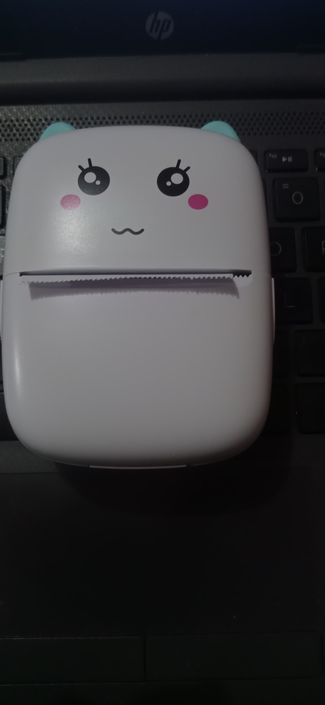

# YHK-miniPrinter




This is a project to print files on a Bluetooth printer from a computer using Python.

## Requirements

- Python 3.x
- Libraries:
  - `PIL` (Python Imaging Library): For image manipulation.
  - `PyMuPDF`: For working with PDF files.
  - `tkinter`: For the graphical interface.
  - `socket`: For communication with the Bluetooth printer.

## Installation

1. Clone the repository:

   ```bash
   git clone https://github.com/Cris-lml007/YHK-miniPrinter.git
   ```

2. Install dependencies:

   ```bash
   pip install Pillow PyMuPDF
   ```

## Usage

1. Run the `main.py` file for command line printing:

   ```bash
   python main.py
   ```

   or run the `gui.py` file to open the graphical interface:

   ```bash
   python gui.py
   ```

2. Enter the MAC address of the Bluetooth printer and click "Connect".
3. Select a PDF file or an image and click "Upload PDF/Image".
4. Click "Print" to print the file on the connected Bluetooth printer.

## Features

- Connection to a Bluetooth printer.
- Printing of PDF files and images.
- Simple graphical interface for an intuitive user experience.

## Contribution

Contributions are welcome. If you would like to improve this project, please:

1. Fork the project.
2. Create a new branch (`git checkout -b feature-improvement`).
3. Make your changes and commit them (`git commit -am 'Add improvement'`).
4. Push to the branch (`git push origin feature-improvement`).
5. Create a new Pull Request.

## Acknowledgements

This project was inspired by YHK-Cat-Thermal-Printer.
